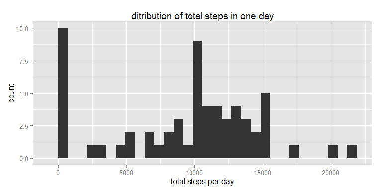
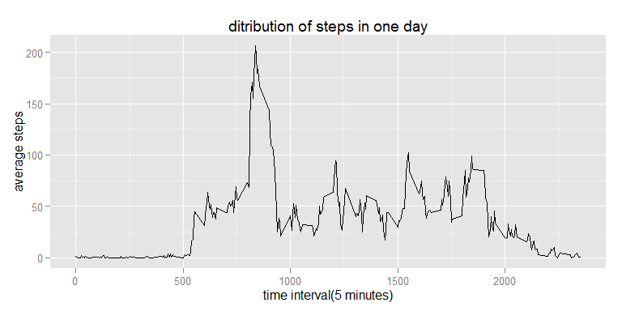
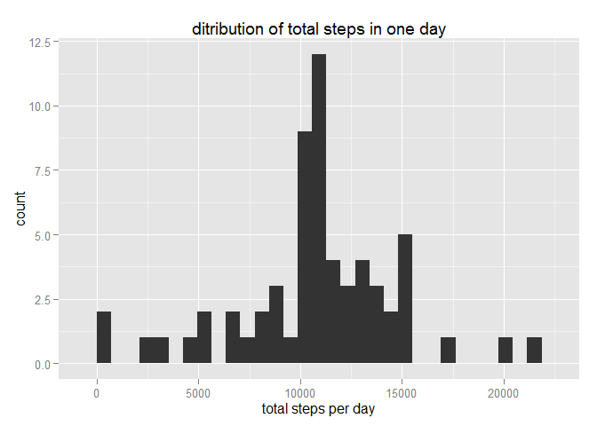
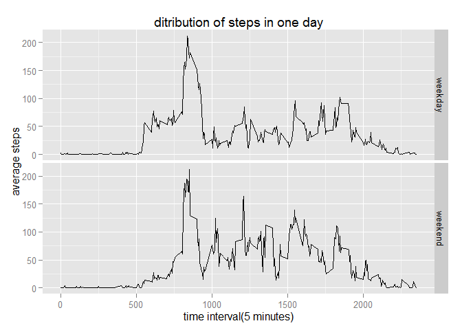

# Reproducible Research: Peer Assessment 1

## Loading and preprocessing the data


```r
#unzip the zip file and  get the file path
filepath <- unzip("activity.zip")

#read the data
activity <- read.csv(filepath,header=T)

#opts_chunk$set(echo=FALSE)
```


## What is mean total number of steps taken per day?

1.  Calculate the total number of steps taken per day

```r
library(dplyr)
totalstep <-group_by(activity,date) %>%
  summarise(stepperday=sum(steps,na.rm=TRUE)) 
```

2. Make a histogram of the total number of steps taken each day

```r
library(ggplot2)
ggplot(data=totalstep,aes(x=stepperday))+geom_histogram()+
  labs(x="total steps per day",y="count",title="ditribution of total steps in one day")
```

```
## stat_bin: binwidth defaulted to range/30. Use 'binwidth = x' to adjust this.
```

 

3.	Calculate and report the mean and median of the total number of steps taken per day

```r
m <-summary(totalstep$stepperday)
#percentdis <- quantile(totalstep$stepperday,probs=c(0.2,0.8))
```
from the graph we can see that this man/women  in most days take 5000-15000 steps per day(0 steps are due to missing value,so just neglect it first because we will fill it later). the mean and median total number steps taken per day is 9354 and 10400 .

## What is the average daily activity pattern?
1.  Make a time series plot  of the 5-minute interval (x-axis) and the average number of steps taken, averaged across all days (y-axis)

```r
meanstep <- group_by(activity,interval) %>% 
  summarise(meanstepday=mean(steps,na.rm=TRUE))
ggplot(data=meanstep,aes(x=interval,y=meanstepday))+geom_line(group=1)+
   labs(x="time interval(5 minutes)",y="average steps",title="ditribution of steps in one day")
```

 

2.  Which 5-minute interval, on average across all the days in the dataset, contains the maximum number of steps?

```r
maxstepindex <- which.max(meanstep$meanstepday)
#meanstep[maxstepindex,1]
```
from the graph we can see that the man/woman start to move at 5:00am and takes the most steps around 835; stop move at around 24:00pm.

## Imputing missing values
1.  Calculate and report the total number of missing values in the dataset (i.e. the total number of rows with NAs)

```r
#sum(complete.cases(activity))
numofmissing <- sum(is.na(activity$steps))
```
2.  Devise a strategy for filling in all of the missing values in the dataset. The strategy does not need to be sophisticated. For example, you could use the mean/median for that day, or the mean for that 5-minute interval, etc.

```r
join_activity <- left_join(activity,meanstep) 
```

```
## Joining by: "interval"
```

```r
#if the steps is mssing ,take the average values
join_activity$imputstep <- ifelse(is.na(join_activity$step),join_activity$meanstepday,join_activity$step)
```
in the dataset there are 2304 missing rows.I just use the average steps taken by this man/women in each interval to fill the missing values in the according time intervals.

3.  Create a new dataset that is equal to the original dataset but with the missing data filled in.

```r
new_activity <- join_activity[,c(2,3,5)]
```

4.	Make a histogram of the total number of steps taken each day and Calculate and report the mean and median total number of steps taken per day. Do these values differ from the estimates from the first part of the assignment?  
What is the impact of imputing missing data on the estimates of the total daily number of steps?

```r
totalstep_imput <-group_by(new_activity,date) %>%
  summarise(stepperday=sum(imputstep,na.rm=TRUE)) 
ggplot(totalstep_imput,aes(x=stepperday))+geom_histogram()+
  labs(x="total steps per day",y="count",title="ditribution of total steps in one day")
```

```
## stat_bin: binwidth defaulted to range/30. Use 'binwidth = x' to adjust this.
```

 

```r
mean(totalstep_imput$stepperday)
```

```
## [1] 10766.19
```

```r
median(totalstep_imput$stepperday)
```

```
## [1] 10766.19
```
the distribution of total steps taken by this man/women change little compared with the previous graph. the number of days that he/she take 0 steps is less than the previous graph, because I have assign average steps to the missing value according time interval.  
the mean and median total number steps taken per day is 1.0766189\times 10^{4} and 1.0766189\times 10^{4} . here we can see after imput missing values the mean total steps is equal to the median total steps taken per day. 


## Are there differences in activity patterns between weekdays and weekends?
1.  Create a new factor variable in the dataset with two levels – “weekday” and “weekend” indicating whether a given date is a weekday or weekend day.

```r
new_activity$date<-strptime(as.character(new_activity$date),"%Y-%m-%d")
library(lubridate)
new_activity <- mutate(new_activity,wd = wday(date),weekend = as.factor((wd==1| wd ==6)))
levels(new_activity$weekend) <- c("weekday","weekend")
```

2.  Make a panel plot containing a time series plot (i.e. type = "l") of the 5-minute interval (x-axis) and the average number of steps taken, averaged across all weekday days or weekend days (y-axis). 

```r
activity_bydayinter <- group_by(new_activity[,c(2,3,5)],weekend,interval) %>%
  summarise(meanstep = mean(imputstep))

ggplot(data=activity_bydayinter,aes(x=interval,y=meanstep))+geom_line()+
  facet_grid(weekend~.)+
   labs(x="time interval(5 minutes)",y="average steps",title="ditribution of steps in one day")
```

 

from the graph we can see that in the weekdays this man/women start move early than weekend.but during the day time of weekends the person takes more steps than weekdays.

